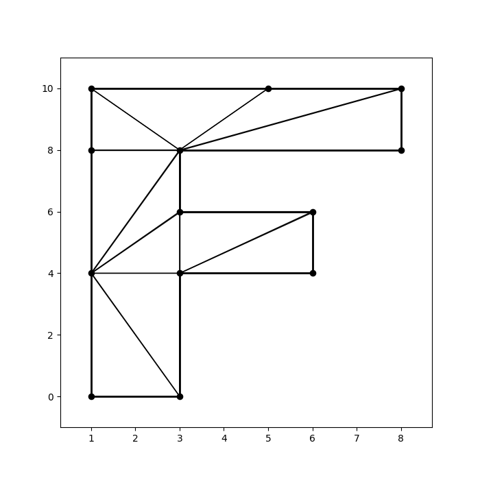

# Computational Geometry
-----------------------------------------------------------
This repository contains some basic CG algorithms, based
on the book "Computational Geometry in C" by J. O'Rourke.

